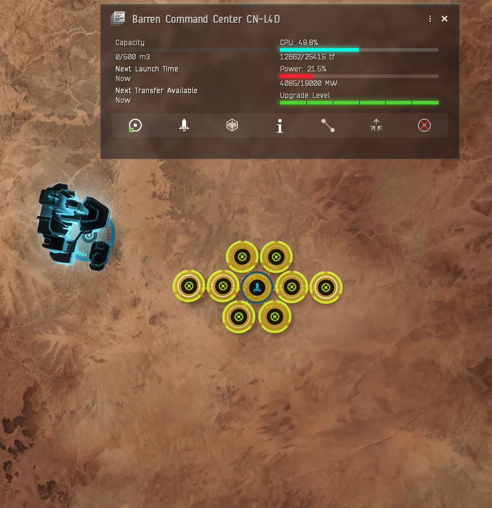
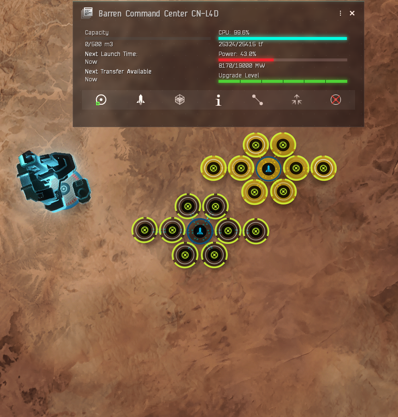

# EVE Online PI Templates 

This repository contains a collection of templates for Planetary Interaction (PI) in **EVE Online**. These templates are designed to optimize your planet setups and production processes for various resources across different Command Center Upgrades skill levels (CCU).

## Features

- **Preconfigured Templates**: Ready-to-use templates for various planetary resources.
- **Support for Different Command Center Levels (CCU)**: Templates tailored for different CCU skills (CCU IV - CCU V).
- **Resource Optimization**: Templates optimized for maximum efficiency and minimal resource waste.
- **Simple Integration**: Easy to integrate into your EVE Online PI setup.

## What's Included?

- **Miners Templates** (P0 → P1 setups for raw extraction and refinement)  
  - Divided into:
    - **Miners CCU IV** – optimized for characters with Command Center Upgrades IV  
    - **Miners CCU V** – optimized for characters with Command Center Upgrades V  
- **Factory P2 Templates** (P1 → P2 setups for intermediate production)
- **Factory P3 Templates** (P2 → P3 setups for advanced manufacturing)
- **Factory P4 Templates** (P3 or P3 + P1 → P4 setups for high-tier final products)

Each setup is crafted for maximum efficiency and usability, depending on your skill level and industrial needs.

## Setup

To use these templates in your **EVE Online** Planetary Interaction, follow these steps:

1. Navigate to the folder:  
   `/Users/<your-user>/Documents/EVE/PlanetaryInteractionTemplates`  
   > **Note:** If you're using **Windows 11** with **OneDrive enabled**, this folder might be located under:  
   `/Users/<your-user>/OneDrive/Documents/EVE/PlanetaryInteractionTemplates`
2. Unzip and paste all json files in the folder above.
3. Refresh your templates menu in game.

## 🖼️ Miners Setup & Factory Preview
Here are some example setups to help visualize the planetary layouts:

### **Miners Setup**

    

*This setup is optimized for maximum extraction efficiency, ensuring a steady flow of raw materials for P1 production.*  

- The **extra Launchpad** (left) is designed for **convenient P1 transfers**, allowing uninterrupted production even when you're not in the same system to pick up resources or transfer them to Orbital Skyhooks.  
- Over time, **resource depletion** will require you to move the extractor head across the planet.  
  - **CCU V templates** allow for this without modifications, as they have spare power.  
  - **CCU IV templates** may require deleting the left Launchpad on some planets to free up power.  
- To keep your facilities running **24/7**, your extractor must produce **1,152,000 P0 (raw materials) per day**.  

### P2 Factory Setup  

    
    

*This is a single **P2 factory** layout. If you have **Command Center Upgrades V (CCU V)**, you can place **two** of these setups on one planet.  
If you have **CCU IV**, you may need to **delete 1 or 2 facilities** from the template to fit within power limits.*  

### **Why this model?**  
- This layout **gives you flexibility**, allowing you to produce **one or multiple P2 products** per planet, depending on your industrial needs.  
- The **central Launchpad** stores **P1 products** and supplies them to the factories to produce **P2 products**.  
- **P2 products** will be stored in the same Launchpad, ensuring **easy access**.  
- **Orbital Skyhooks** can be used to store extra P1 materials and transfer them when production requires it.  
- This setup **maximizes efficiency** while keeping logistics simple.

### P3 Factory Setup  

    
    

*This is a single **P3 factory** layout. If you have **Command Center Upgrades V (CCU V)**, you can place **two** of these setups on one planet.  
If you have **CCU IV**, you may need to **delete 1 or 2 facilities** from the template to fit within power limits.*  

### **Why this model?**  
- This layout **gives you flexibility**, allowing you to produce **one or multiple P3 products** per planet, depending on your industrial needs.
- According to your needs this model will work with mix **P2 + P3 model on one planet**.   
- The **central Launchpad** stores **P2 products** and supplies them to the factories to produce **P3 products**.  
- **P3 products** will be stored in the same Launchpad, ensuring **easy access**.  
- **Orbital Skyhooks** can be used to store extra P2 materials and transfer them when production requires it.  
- This setup **maximizes efficiency** while keeping logistics simple. Allows you to mix models **P2 + P3 / P3 + P3** to be flexible.

### P4 Factory Setup  

    
    

*This is a single **P4 factory** layout. If you have **Command Center Upgrades V (CCU V)**, you can place **two** of these setups on one planet.  
However, **CPU is the main limiting factor** with P4 production — not power.  
If you have **CCU IV** (Command Center Upgrades level IV), it's recommended to **run only one P4 chain** or remove some facilities to avoid exceeding the CPU cap.*  

### **Why this model?**  
- This layout is optimized for producing **high-tier P4 products**, using inputs from **P3 or P2 sources**.  
- The **central Launchpad** handles all routing — storing **input materials** and **P4 outputs** for streamlined access.  
- Ideal for **centralized P4 production**, especially when fed by other planets specializing in P2 or P3 production.  
- You can use this layout in combination with **dedicated input planets** or **hybrid setups** to suit your industrial flow.  
- Works well with **expedited transfers** or regular launches from feeder planets.  
- This setup focuses on **efficiency and simplicity**, making it easier to manage high-value production chains.  
- Can also be used in **hybrid models**, such as **P4 + P3** or **P4 + P2** factories on a single planet — especially useful with **CCU IV**.  

    

  *Example: producing both **Broadcast Nodes** (P3) and **High-Tech Transmitters** (P4) from the same setup.*

## License

This project is licensed under the MIT License - see the [LICENSE](LICENSE) file for details.

## Contributing

We welcome contributions from the community! If you have a template to add or an enhancement to suggest, please feel free to fork this repository, make your changes, and submit a pull request.

### [Factory Default Schema](https://github.com/MattFalahe/EVE-PI-Templates/blob/dev/Templates/Schema/Default%20Schema%20for%20Factory.json)

*In the Schema folder, you'll find the default schema describing how factory templates are structured. This file serves as a reference to help you understand how templates are built and what format they follow. It provides a basic overview of the expected structure and fields used in the factory templates.*

### Steps for contributing:

1. Fork this repository.
2. Create a new branch (`git checkout -b feature/your-feature`).
3. Make your changes and commit them (`git commit -am 'Add new template for Biofuels'`).
4. Push to your forked repository (`git push origin feature/your-feature`).
5. Open a pull request with a description of your changes.

## Acknowledgements

- EVE Online for providing the rich world of Planetary Interaction.
- The community for contributing feedback and suggestions to improve these templates.

## Contact

For any questions, suggestions, or issues, please feel free to open an issue on the repository or contact the project maintainer directly in game - Matt Falahe.
